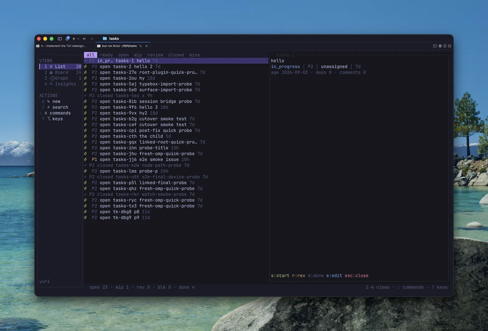
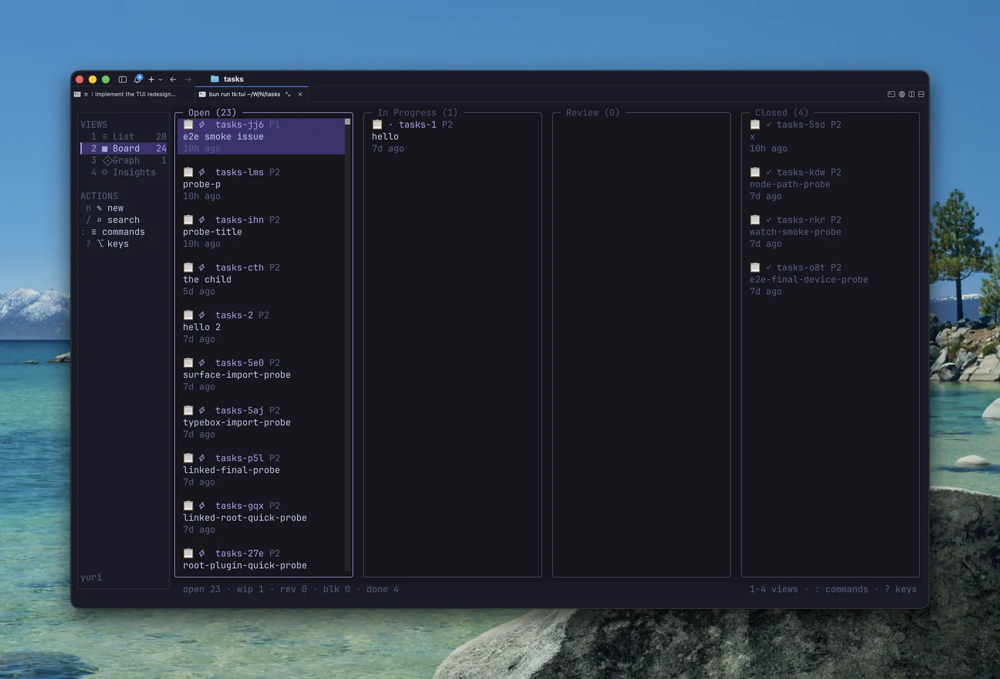

# Tasks

Local-first issue tracker with dependency chains. Inspired by [beads](https://github.com/steveyegge/beads), redesigned as a TypeScript library with pluggable storage adapters (SQLite, PostgreSQL, file-based).

## What's different from the original

- **Library-first**: clean hexagonal architecture — domain, application ports, and swappable adapters
- **Multiple backends**: file-based (default, git-committable JSON per issue), SQLite, and PostgreSQL
- **Bun-native**: runs directly from TypeScript source via `bun`, no build step required for CLI
- **Beads migration**: `tk migrate` imports a `.beads/` workspace issue-by-issue, non-destructively

## Install

Prebuilt self-contained binaries (no Bun required) for linux/darwin on arm64/x64:

```bash
# Homebrew (macOS and Linux)
brew install nsxbet/tap/tasks

# One-line script — latest stable release, checksum-verified
curl -fsSL https://raw.githubusercontent.com/NSXBet/tasks/main/install.sh | sh

# Nightly pre-release from every push to main
curl -fsSL https://raw.githubusercontent.com/NSXBet/tasks/main/install.sh | sh -s -- --latest

# Pinned version
curl -fsSL https://raw.githubusercontent.com/NSXBet/tasks/main/install.sh | sh -s -- v0.3.0
```

The script installs to `~/.local/bin/tk` (override with `TK_BIN_DIR`). Later,
`tk update` self-updates in place — or `brew upgrade nsxbet/tap/tasks` for
Homebrew installs — and `tk update --latest` moves to the newest nightly.

## Requirements

- [Bun](https://bun.sh) 1.3+ (only for running from source; the installed binary is self-contained)

## Quick start

```bash
bun install

# Run CLI directly from source
tk init
tk create "Fix login bug"
tk ready --claim --json
```

## Packages

| Package | Description |
|---------|-------------|
| `@tasks/domain` | Pure issue model: branded types, Zod schemas, invariant validation |
| `@tasks/application` | Use-case contracts, inbound/outbound ports |
| `@tasks/sqlite` | SQLite adapter (Bun built-in `bun:sqlite`) |
| `@tasks/postgres` | PostgreSQL adapter with migrations |
| `@tasks/file` | File-based adapter — one JSON per issue, git-friendly |
| `@tasks/workspace` | `.tasks/config.json` schema, backend resolution/inference, adapter lifecycle |
| `@tasks/beads` | Beads migration: record decoding, parent ordering, transactional import |
| `@tasks/cli` | `tk` CLI executable |
| `@tasks/surface` | Host-agnostic typed command surface: JSON-in/JSON-out operations shared by the CLI and the pi/omp extension |
| `@tasks/tui` | OpenTUI-based terminal UI: list, kanban board, dependency graph, insights |

## Architecture

```
CLI / adapters (file, sqlite, postgres)
              ↓
      @tasks/application    ← ports define the contract
              ↓
        @tasks/domain       ← pure types, no IO
```

Domain never imports application or adapters. Application coordinates domain types without choosing persistence. Adapters implement application ports (`UnitOfWork`, `IssueUnitOfWork`, `MigrationPort`).

## CLI usage

```bash
tk init [--prefix <p>] [--backend ...]  # Initialize .tasks/ workspace (default prefix: tk, backend: file)
tk create <title> [opts]      # Create issue
tk list [--status <s>]        # List issues; shorthands: --open --closed --all --ready-to-review --approved --rejected
tk ready [--claim]            # List unblocked issues
tk show <id>                  # Show issue details
tk close <id>                 # Close issue
tk update <id> [--branch <name>]  # Update fields; link the issue branch
tk dep <id> add <target>      # Add dependency
tk attach <id> <path>        # Attach a file path (--attach-metadata k=v,k2=v2)
tk detach <id> <path>        # Remove an attachment
tk tui [workspace]            # Launch the terminal UI (list/kanban/graph/insights)
tk watch [--kinds a,b] [--ids x,y]   # Stream issue-change events as NDJSON (foreground)
tk tree [--all] [--depth N]  # Tree view: epics, subtasks, dependency fan-out
tk search <text>              # Full-text search
tk hunk <id> [--print]        # Open a Hunk review of the issue's branch/WIP
tk hunk <id> sync             # Import live Hunk review comments into the issue
tk export                     # Export all as JSONL
tk update                     # Self-update the binary (--latest for nightlies, --check to inspect)
tk agent create <name> [opts]  # Register an agent (see Agents and runs below)
tk runs [--issue <id>] [--state <s>]  # List runs; tk run show|cancel|rerun|message <id>
tk --help                     # Full command list
```

`tk` discovers `.tasks/` by walking upward from cwd. Use `-C DIR` to override. `--json` for structured output, `--markdown` (or `--md`) for markdown — issue lists render as `## id — title` sections separated by `---`. `--readonly` rejects mutations.

### Sprints

A sprint is a focus bucket: at most one sprint is `active` per workspace, and
`tk list` can be scoped to it. Sprints are first-class records (`.tasks/sprints/`
on the file backend, a `sprints` table elsewhere) and survive export/import.

```bash
tk sprint start "Week 34"     # Create + activate; completes any active sprint
tk sprint start "Week 35" --carry   # ...moving its unfinished issues into the new sprint
tk sprint add <id>            # Move an issue into the active sprint
tk sprint remove <id>         # Move an issue back to the backlog
tk sprint move <id> <slug>    # Move an issue into a named sprint (any status)
tk sprint close               # Complete the active sprint; issues return to the backlog
tk sprint list                # Active focus first, then completed sprints
tk list --sprint active       # Scope: active | current | backlog | none | <slug>
```

Restarting a sprint enforces the single-active invariant in one transaction:
the previous focus is marked `completed` (stamping `completed_at`) and its
issues drop to the backlog unless `--carry` moves them forward.

### Archive (icebox)

Archiving hides work from default views without deleting it — "start from
zero" while keeping everything for reference:

```bash
tk archive <id>               # Hide: status → archived, prior status kept in metadata.archivedFrom
tk unarchive <id>             # Restore to the status it had when archived
tk list --archived            # Show only the icebox
tk list --all                 # Everything, archived included
```

Default `tk list`, `tk ready`, and the TUI/Web boards all exclude archived
issues; `tk ready` never surfaces them regardless. The TUI has an `icebox`
tab (`!` toggles sprint membership on a card); the extension exposes
`archive`/`unarchive` and `sprint-*` ops on the `tasks` tool.

### Agents and runs

Agents are a registry — who can be dispatched on issues — with runs as the
execution record of that dispatch. Agents are first-class records like sprints
(`.tasks/agents/` on the file backend, an `agents` table elsewhere); runs
persist alongside them. Agents are never deleted, only archived:

```bash
tk agent create <name> --description ... --owner ... --runtime ... \
    --access ... --mode ... --instructions ... \
    --skill <s> --env k=v          # repeatable; status starts offline
tk agent list [--archived] [--status online|idle|offline]
tk agent get <id>                # alias: tk agent show
tk agent update <id> [--description ... --instructions ...]  # ≥1 flag required
tk agent archive <id>            # stamps archivedAt (status → offline); idempotent
tk agent unarchive <id>          # clears archivedAt; idempotent
tk agent copy <id> --name <new-name>   # duplicate with a fresh slug
tk agent issues <id>             # issues assigned to the agent
```

Every dispatched execution is a run: `<issueId>-run-<n>`, queued before it
starts, carrying its message log and token/cost usage. Runs are driven by
issue status moves — claiming an issue (`in_progress`) queues a run,
`ready-to-review` moves it `in_review`, rejection marks it `failed`, archiving
cancels it, closing marks it `done` — so the ledger stays true even for runs
driven by outside tools:

```bash
tk runs                          # newest first; --issue <id> or --state <s> to filter
tk run show <id>                 # full record incl. messages and usage
tk run cancel <id>               # only queued|running runs; stamps closedAt
tk run rerun <id>                # fresh queued run for the same issue (manual trigger)
tk run message <id> <text>       # append a log message (--stdin to pipe; terminal runs reject)
```

A run is "active" only while `queued|running` — the states that may still
change on their own. The extension receives a `run.changed` watch event
(`kinds: run.changed`) so sessions can react to run lifecycle transitions.

Watch children (`tk watch`) self-register as runtimes in `.tasks/runtime.json`
and heartbeat on every poll tick, so `tk runtime list` shows what is actually
alive. A deferred issue whose `--defer-until` has passed is undefered by the
watch tick and — when it has an assigned agent — gets a queued run with
trigger `wakeup` (once per expiry):

```bash
tk runtime list                  # live watch children + their heartbeat ages
tk runtime activity [n]          # recent runtime events (starts, wakeups)
tk inbox                         # runs awaiting attention, unread first
tk inbox read <runId>            # mark a run's inbox entry read (also: archive; --all to include)
```

#### Walkthrough: the agent-dispatch loop

The registry above is the setup; this is the daily loop. In a scratch
workspace (or your own):

```bash
# 1. Register the agents that can be dispatched
tk agent create scout --runtime claude --access project \
    --instructions "Investigate, then report findings via run messages"
tk agent create builder --runtime claude --access project

# 2. Put an agent on an issue — the assignment is what runs record
#    (`tk q` creates and prints just the new id)
ID=$(tk q "Fix flaky sqlite test"); tk assign $ID scout

# 3. Work the issue by moving its status; runs follow automatically
tk update $ID --status in_progress          # → run $ID-run-1 queued
tk runs --issue $ID                         # watch the ledger fill in
tk run message $ID-run-1 "repro confirmed, poking storage adapter"
tk update $ID --status ready-to-review      # → run in_review
tk run message $ID-run-1 --stdin < driver-progress.log  # pipe a driver's log in
tk update $ID --status closed               # → run done

# 4. Audit the ledger — it outlives the work and stays tool-agnostic
tk run show $ID-run-1                       # full record: trigger, messages, usage
tk runs --state in_review                   # everything awaiting review
```

Each run records who (agent), why (trigger: `status-move`, `manual`,
`wakeup`), and what happened (message log + token/cost usage) — no matter
whether you flipped the status or an external tool did. Keep `tk watch`
running in a pane: it registers itself as a live runtime (`tk runtime list`),
fires wakeups for expired `--defer-until` deadlines on assigned issues, and
feeds `run.changed` events to the extension. Anything an agent leaves in
`in_review` surfaces in `tk inbox` until you `tk inbox read <runId>` — that
is your review queue.

### Terminal UI

`tk tui` launches a full terminal UI (OpenTUI + React, alternate screen, mouse-aware):

```bash
tk tui                  # discover workspace from cwd like the CLI
tk tui /path/to/ws      # or point it at a workspace
```

Four views (`1-4`), a persistent nav rail with live counts, and a statusbar:

| View | Key | What it shows |
|------|-----|---------------|
| List | `1` | filter chips (`all/ready/open/wip/review/closed/mine`), glyph+priority rows, right-aligned ages, detail pane |
| Board | `2` | kanban columns (Open / In Progress / Review / Closed, Parked when non-empty), `h/l/j/k` movement, in-place status moves (`s/r/o/d`) |
| Graph | `3` | dependency tree centered on selection, `▲ BLOCKED BY` / `▼ BLOCKS` sections, `(cycle)` markers |
| Insights | `4` | ready picks, blocked panel with unblock-gain, critical chain, cycles / DAG health |





Global surfaces: `:` command palette (fuzzy-filtered commands with keycaps), `/` search,
`n` new issue, `?` key reference, `ctrl+c`/`ctrl+q` quit. Confirmation prompts take
`↵`/`y` to accept, `n`/esc to cancel. Selection ↔ detail stays in sync, edits
go through the same surface as the CLI, and the watch-poll picks up external `tk` changes live.

### File attachments

Issues can carry file-path attachments — references, not copies. Paths resolve
against the current directory and are stored workspace-relative, so
`tk create "x" --attach foo.yaml` attaches the repo-root `foo.yaml`. Attachments
can carry metadata: inline `--attach 'docs/plan.md={"kind":"plan"}'` (repeatable)
or a trailing `--attach-metadata kind=input,k2=v2` applying to the last path.
`tk update <id> --attach <path>` and `--detach <path>` work ad hoc; attaching an
existing path replaces its metadata.
`--plan <path>` (on `create`/`update`) sets the issue's plan through the same
system — it attaches the file with `kind: "plan"` metadata and replaces any
prior plan attachment, leaving other attachments untouched.

### Hunk integration

[Hunk](https://github.com/modem-dev/hunk) is a review-first terminal diff viewer. Link the
issue branch and review it in one command:

```bash
tk update tk-abc --branch feature/auth     # link the issue branch
tk hunk tk-abc                            # opens Hunk in that branch's worktree, diffed from its merge base
tk hunk tk-abc --print                    # print the underlying Hunk command instead of launching it
tk hunk tk-abc -- --mode split            # forward extra flags to Hunk after `--`
```

The issue's title and description are injected as a Hunk `--agent-context` sidecar, so they render beside
the diff. With a live Hunk session open on the repo, `tk hunk tk-abc sync` imports the review comments as
task comments (`[hunk file:line] summary`); a `hunkComments` list in the issue's metadata keeps repeated
syncs idempotent.

### Agent skill

tk ships an LLM-facing skill — the authoritative machine docs for every op and
flag (ops table, attachment/plan semantics, JSON contracts). Like Hunk's
`hunk-review` skill, it is printed or installed from the CLI so guidance never
drifts from the binary:

```bash
tk skill                     # print the full SKILL.md
tk skill --json              # { path, skill } for programmatic loading
tk skill path                # installed skill file location only
tk skill --install ~/.pi/agent/skills   # symlink into an agent skills dir
```

### Storage backend

The backend is a `.tasks/config.json` property, resolved once per workspace — no command reads a runtime `--backend` flag; the only place `--backend` exists is `tk init`, as a convenience for writing the config instead of hand-editing it:

```bash
tk init                                          # storage.backend: "file" (default)
tk init --backend sqlite [--filename <name>]     # storage.backend: "sqlite"
tk init --backend postgres [--url-env <VAR>]     # storage.backend: "postgres"
tk init --help                                   # full flag reference and examples
```

Each of those writes into `.tasks/config.json`:

```json
{ "prefix": "tk", "storage": { "backend": "file" } }
```

`storage.backend` is one of:

| Backend | Config | Notes |
|---|---|---|
| `file` | `{ "backend": "file" }` | Default. One JSON file per issue under `.tasks/issues/`, see below. |
| `sqlite` | `{ "backend": "sqlite", "filename"?: string }` | `filename` is relative to `.tasks/`, defaults to `tasks.db`. |
| `postgres` | `{ "backend": "postgres", "urlEnv"?: string, "url"?: string }` | Connects via env var indirection by default (`urlEnv`, default name `TASKS_DATABASE_URL`) so connection strings never need to live in committed config. `url` is a literal fallback, discouraged for anything with credentials — `tk init` has no `--url` flag on purpose, to avoid connection strings landing in shell history. |

Switching backends on an existing workspace: use `tk switch-backend <file|sqlite|postgres>` (see `tk switch-backend --help`). It reads every issue from the current backend, writes them all into the target, and only then flips `storage.backend` in `.tasks/config.json` — the old backend's data is never deleted automatically, so verify with `tk doctor`/`tk list` before cleaning it up by hand. `--dry-run` reports what would move without writing anything. A workspace with an existing `.tasks/tasks.db` but no `storage` key is treated as `sqlite` (inferred from disk, not silently defaulted to `file`), so upgrading `tk` never orphans pre-existing data; every workspace `tk init` creates from here on writes an explicit `storage.backend`.

`tk export`/`tk import` also move data between backends manually (and between two entirely separate workspaces) using the same beads-compatible JSONL format: `tk -C <source> export | tk -C <target> import`. `switch-backend` is exactly that sequence, wrapped into one step that also updates the target workspace's own config.

`tk where` reports the resolved backend and location without opening a connection; `tk doctor` opens it and reports health.

### Migration from beads

`tk migrate` imports a beads workspace into `.tasks/`:

```bash
tk migrate                       # import via `bd export --all` (default)
tk migrate --dry-run --json      # report what would be imported, write nothing
tk migrate --source jsonl        # read .beads/issues.jsonl instead of invoking bd
tk migrate --on-conflict skip    # skip (default) | overwrite | fail
tk migrate --bd /path/to/bd      # pin the beads executable
```

The source workspace is never renamed, moved, or modified, so `bd` keeps
working against `.beads/` after migration. Beads stores issues in an embedded
Dolt database that only `bd` can read — `.beads/issues.jsonl` is a passive
export that is usually empty — so `bd export` is the default source and an
empty JSONL is reported as an error rather than a successful empty migration.

Migration runs in a single transaction: either every issue lands or none does.
Issues are ordered parent-first so parent links resolve regardless of export
order, and non-issue beads records (memories, infra beads, templates, gates)
are *carried* — reported rather than rejected, so one memory cannot abort the
run. `tk migrate` is idempotent; re-running skips issues already present.

The JSON report accounts for every record read:

| Field | Meaning |
| `imported` / `skipped` / `overwritten` | issue outcomes |
| `carried` | non-issue records, by line and type |
| `rejected` | undecodable records, with line and field |
| `detached_parents` | parent links dropped because the parent is absent |
| `cycles` | parent cycles broken to stay persistable |

If an older `tk` already renamed `.beads/` to `.tasks/`, `tk` detects the
moved beads database and tells you how to restore it before migrating.

## Agent extension (pi / omp)

The repo ships as an installable extension for [pi](https://github.com/earendil-works/pi-coding-agent) and omp, exposing the full tk surface as LLM tools plus live change notifications.

### Install

```bash
omp install github:NSXBet/tasks
```

omp (and pi) resolve the repo, read the `pi`/`omp` manifest keys in the root
`package.json` — pointing at `packages/extension/src/index.ts` and the
`packages/extension/skills/*/SKILL.md` skill — and copy the plugin into
`~/.omp/plugins/`. `#ref` pins a branch, tag, or commit
(`github:NSXBet/tasks#v1.2.0`).

To install from a local checkout instead (symlinked, live for edits):

```bash
omp install /path/to/tasks/packages/extension
```

Both hosts run TypeScript directly (omp is a Bun binary; pi loads `.ts`
extensions via jiti under node), so there is no build step and no committed
bundles. The extension sources `@tasks/surface` as a workspace dep; the watch
child entry ships inside the surface package.

To install from a local checkout instead (symlinked, live for edits):

```bash
omp install /path/to/tasks/packages/extension
```


### Tools

| Tool | Purpose |
|---|---|
| `tasks` | Full tk surface through one `op`-parameterized tool: `create`, `quick`, `show`, `list`, `ready`, `blocked`, `update`, `close`, `reopen`, `defer`, `claim`, `comment`, `dep-add`, `dep-remove`, `rename`, `delete`, `todo`, `todo-done`, `search`, `query`, `counts`, `stats`, `tree`, `graph`, `duplicates`, `lint`, `children`, `epic`. Returns JSON. |
| `tasks_ready` | The unblocked backlog — call when about to run out of work. |
| `tasks_watch_start` | Spawn a watcher child that notifies the session when issues change. Filter with `kinds` (`issue.created`, `issue.updated`, `issue.status_changed`, `issue.deleted`, `comment.created`, `ready.changed`), `ids`, `label`, `interval` (ms). |
| `tasks_watch_status` | Active watchers with seq watermark and last event. |
| `tasks_watch_stop` | Stop one watcher (by id) or all. |

### Watching for changes

The principal feature: a background process polls the workspace and steers a
notification into the session when a subscribed event fires — the agent gets a
follow-up turn without being prompted.

```
tasks_watch_start { "kinds": ["issue.created", "issue.status_changed"], "ids": ["tk-abc"] }
```

- Notifications arrive via `sendUserMessage(text, { deliverAs: "followUp" })` — identical primitive on pi and omp.
- Keep subscriptions narrow (`kinds` + optional `ids`/`label`); a watcher on every update is noise.
- Watchers die with the session; stop them explicitly with `tasks_watch_stop` when done.
- The same stream is available in a terminal: `tk watch --kinds issue.created`.

A widget bubble above the editor lists active watchers, their uptime, and the
last event per watcher (hidden while no watchers run).

### Commands

| Command | Purpose |
|---|---|
| `/tasks` | Print current tasks — open issues in this workspace (id, title, assignee). |
| `/tasks watch` | Show active task watchers — count, name, last event, seq watermark. |

Agents drive everything through the tools; the commands are human-facing
health checks in the composer.

### Skill

Installing the extension injects the `tasks` skill, which teaches agents the
workflow above (tools-over-shell, claim/comment/close conventions, watcher
etiquette). It loads through the same manifest mechanism as the extension
bundle; no separate configuration.


The file adapter (the default backend) stores each issue as an individual JSON file:

```
.tasks/
├── meta.json                 # { "backend": "file", "version": null, "prefix": "tk" }
├── issues/
│   ├── tk-a3f2dd.json        # one file per issue (wire format)
│   └── tk-c7e1ab.json
└── history/
    ├── tk-a3f2dd.jsonl       # append-only audit log
    └── tk-c7e1ab.jsonl
```

Git-friendly: per-issue diffs, no binary DB files, merge conflicts scoped to individual issues.

## Testing

```bash
# All tests (vitest + bun test)
bun test packages/sqlite/test/sqlite.test.ts
bun test packages/workspace/test/workspace.test.ts
bun test packages/beads/test/beads.test.ts
bun test packages/cli/test/tk.test.ts
npx vitest run packages/file/test/file.test.ts
npx vitest run packages/domain/test/issue.test.ts
bun test packages/cli/test/tk.test.ts
bun test --timeout 30000 packages/tui/test/app.test.tsx   # renderer tests (OpenTUI test-utils)
bun packages/tui/test/smoke.ts                            # pty E2E via tmux (real binary, real storage)
```

## Credits

Inspired by [beads](https://github.com/steveyegge/beads) by Steve Yegge. Restructured as a multi-adapter TypeScript library with pluggable storage.
